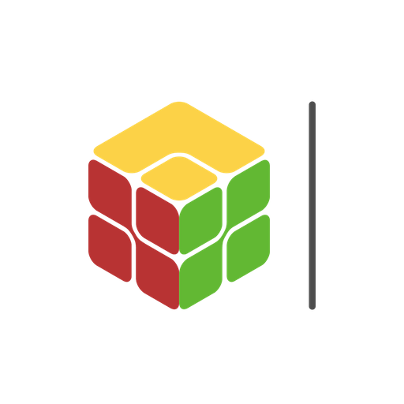
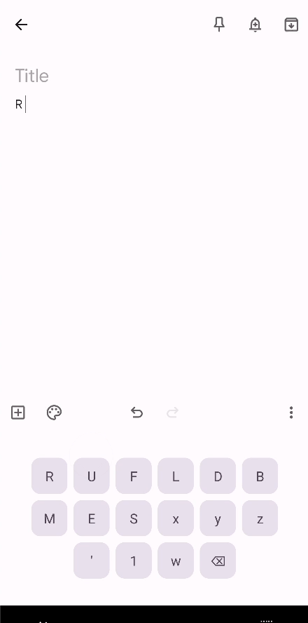
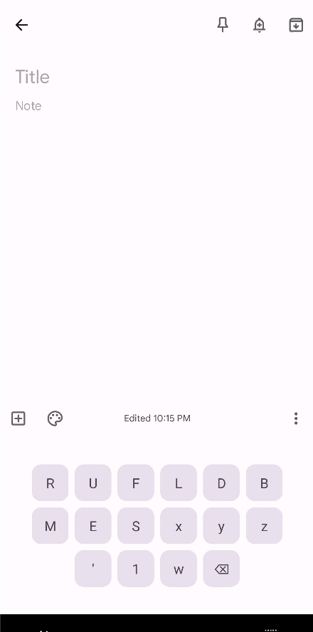

<h1 align="center">HUSH Keyboard</h1>

    
    
    

      

## Introduction

Typing Rubik's Cube notations on a mobile keyboard kind of a frustration, switching between
notations, numbers, and symbols makes it extremely annoying.
HUSH Keyboard provides a specialized Rubik's Cube keyboard that is functional, minimal, and
customizable.

By the way,

**HUSH Keyboard is live on Google Play!**

## Features

| Feature       | Description                                           | Demo                                                          |
|---------------|-------------------------------------------------------|---------------------------------------------------------------|
| Tooltip hints | Shows input key hints on tap                          |  |
| State control | Modify keyboard state by tapping control buttons      |  |
| Gesture input | Swipe right, left, up, down to input common notations |  |

## License

This project is licensed under the GPL license (version 3 or later). This means that this library is
free to use, although you must publish any code that uses it (e.g. also put it on GitHub). See
the [full license](https://github.com/ricky9667/HushKeyboard/blob/master/LICENSE) for exact details.
